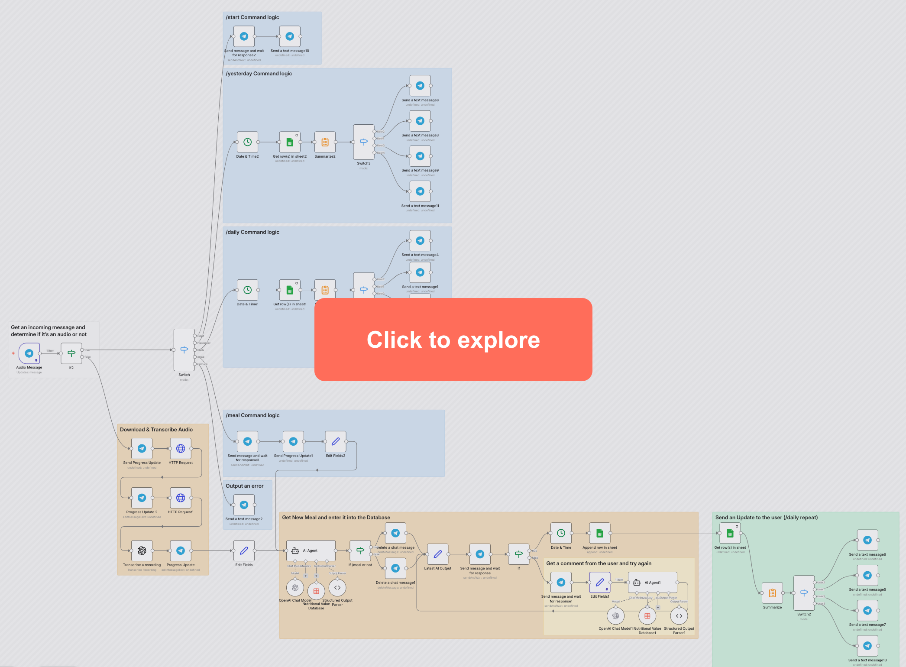

# AI Calorie Tracker (n8n + Telegram + OpenAI)

🚀 **Track your calories automatically using voice messages.**  
No apps. No manual logging. Just send what you ate.

A fully automated calorie tracking system built with **n8n**, powered by **AI**, and integrated into **Telegram**.
Log your meals using **voice or text**, and the system will:

* Transcribe audio 🎙️
* Parse ingredients 🍝
* Calculate macros & calories 📊
* Store everything in Google Sheets 📄
* Let you confirm or edit entries ✅

---
## 🔍 Interactive Workflow

[](https://kirilleraser.github.io/n8n_Calorie_Tracker/)

👉 Click to explore the full automation in an interactive n8n-style viewer

## 🚀 Features

* 🎙️ Voice-to-calorie tracking (automatic transcription)
* 🌍 Multilingual support (English + Russian)
* 🤖 AI-powered nutrition parsing
* 📊 Automatic macro calculation (protein, fat, carbs, kcal)
* 🧾 Google Sheets logging
* ✏️ Edit/approve system before saving
* 📅 Daily & yesterday stats
* 👤 Personalized calorie targets per user

---

## ⚙️ Workflow Overview

### 1. Input Handling

* Telegram bot receives message
* Detects:

  * Voice message → transcription flow
  * Command (/meal, /daily, /yesterday)
  * Invalid input → error response

### 2. Audio Processing

* Downloads audio from Telegram
* Transcribes using OpenAI
* Converts into structured text

### 3. AI Parsing

* Extracts:

  * Ingredients
  * Amounts (g/ml)
  * Nutritional values
* Calculates totals
* Outputs structured JSON

### 4. User Confirmation

* Sends formatted meal summary
* User can:

  * ✅ Approve
  * ❌ Edit (feedback loop with AI correction)

### 5. Data Storage

* Saves to Google Sheets:

  * Ingredients
  * Macros
  * Calories
  * Timestamp
  * Raw JSON

### 6. Analytics

* `/daily` → today's totals
* `/yesterday` → previous day totals
* Personalized targets shown in response

---

## 🤖 AI Logic

The system uses an OpenAI-powered agent that:

* Understands mixed language input (RU + EN)
* Infers missing quantities (default 100g/ml)
* Uses standard nutrition values when missing
* Normalizes food names
* Outputs strict JSON format

Example output:

```json
{
  "ingredients": [
    {
      "name": "spaghetti",
      "amount": 200,
      "unit": "g",
      "fat_g": 3,
      "protein_g": 22,
      "carbs_g": 142,
      "kcal": 680
    }
  ],
  "total": {
    "fat_g": 3,
    "protein_g": 22,
    "carbs_g": 142,
    "kcal": 680
  },
  "log_time": "2025-10-11T18:09:02Z"
}
```

---

## 🧩 Tech Stack

* **n8n** – automation engine
* **Telegram Bot API** – user interface
* **OpenAI (GPT-5.1)** – parsing + reasoning
* **Google Sheets API** – storage

---

## 🛠️ Setup

### 1. Requirements

* n8n instance (self-hosted recommended)
* Telegram Bot Token
* OpenAI API Key
* Google Sheets API credentials

### 2. Import Workflow

1. Download the JSON workflow
2. Import into n8n
3. Configure credentials:

   * Telegram
   * OpenAI
   * Google Sheets

### 3. Configure Bot

* Set webhook
* Add allowed user IDs (optional)

### 4. Run

* Activate workflow
* Send a message or voice note to your bot

---

## 💬 Commands

* `/start` – Setup calorie & macro goals
* `/meal` – Log a meal manually
* `/daily` – Show today's stats
* `/yesterday` – Show yesterday's stats

---

## 📊 Example Flow

1. User sends voice:

   > "200 grams spaghetti, 100 grams chicken"

2. AI processes → returns:

   * Calories
   * Protein
   * Fat
   * Carbs

3. User confirms → saved to sheet

4. `/daily` → shows totals + targets

---

## 🔥 Why This Project is Cool

* Combines **AI + automation + real-world utility**
* Fully hands-free calorie tracking
* Works in multiple languages
* Extensible (fitness apps, dashboards, etc.)

---

## 📌 Future Improvements

* Barcode scanning
* Photo-based food recognition
* Mobile dashboard
* Integration with fitness trackers

---

## 🧑‍💻 Author

Built by Kirill — Robotics student & automation engineer.

---

## ⭐ If you like it

Star the repo and fork it 🔥
